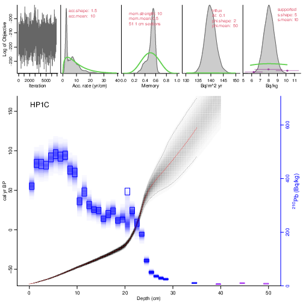
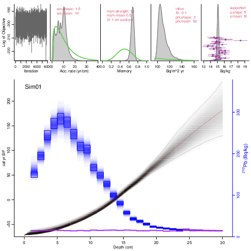
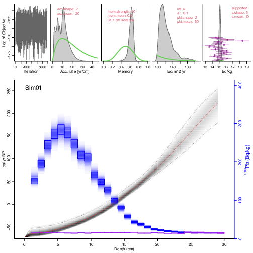
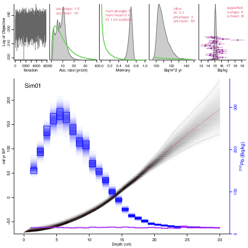

## Installing Plum

There are two ways to install rplum. The first way is to install it using the origial R repositories:
  
```{r eval=F}
rm(list=ls())
install.packages("IntCal")
install.packages("rbacon")
install.packages("rplum")
```

The second way to install it is by installing from Maarten's github by using the _devtools_ package 

```{r eval=F}
install.packages("devtools")  # if you dont have devtools install
remotes::install_github("Maarten14C/IntCal")
devtools::install_github("Maarten14C/rbacon")
remotes::install_github("maarten14C/rplum")
```

## Loading and running Plum 
  
Now that we have the package installed lets load it and run the default core. 
```{r eval=F}
library(rplum)
Plum()
```



This plots shows the results from the model and it is important to don't cut the top panels as they show all the necessary information for the analysis of the chronology and replication of the results. 

## Running your cores

In order to run your own cores you have to put your data in a folder with the same name as the file, inside the __Plum_runs__ folder. In __R__ you can use the command _Plum_ with the name of the file as follows.

```{r eval=F}
Plum("Sim01")
```


## Changing the prior distributions

Default prior distributions in both _Bacon_ and _Plum_ are initial guess of the accumulation rates. These are in some cases a good initial guess but if you have information about the accumulation rate this should be change as follow:

```{r eval =F}
Plum('Sim01',acc.mean = 20 ,acc.shape = 2)
```

## Changing the memory

The memory parameter in these models defines the stiffness of the model, the default value in this case would allow the model to be more flexible if necessary. 


```{r eval =F}
Plum('Sim01',mem.mean = .1,mem.strength =  5)
```



## Plotting accumulation rates at specific depth

```{r eval = F}
Plum("HP1C")
accrate_d10 <- accrate.depth(d = 10)
summary(accrate_d10)
mean(accrate_d10);var(accrate_d10)
plot(density(accrate_d10) ,main='Accumulation Rate at depth 10 cm',xlab='yr/cm',ylab='')

accrate_d25 <- accrate.depth(d = 25,cmyr = TRUE)
head(accrate_d25)
mean(accrate_d25);var(accrate_d25)
summary(accrate_d25)
plot(density(accrate_d25) ,main='Accumulation Rate at depth 25 cm',xlab='cm/yr',ylab='')
```


## Plotting accumulation rates at specific age

```{r eval = F}
accrate_a300 <- accrate.age(age=3)
head(accrate_a300)
mean(accrate_a300);var(accrate_a300)
summary(accrate_a300)
plot(density(accrate_a300) ,main='Accumulation Rate at age 3 BP',xlab='yr/cm',ylab='')
hist(accrate_a300,breaks = 100)

acc_rate_10 <- accrate.age(age = -10,cmyr = TRUE)
head(acc_rate_10)
mean(acc_rate_10);var(acc_rate_10)
plot(density(acc_rate_10) ,main='Accumulation Rate at ageh -10 BP',xlab='cm/yr',ylab='')
```


## Plotting accumulation rates for whole model by depth

```{r eval = F}
accrate.depth.ghost(cmyr = T, acc.lim = c(0,1.5) )
accrate.depth.ghost(acc.lim = c(0,15), d.lim = c(0,10))
```


## Plotting accumulation rates for whole model by age

```{r eval = F}
accrate.age.ghost(acc.lim = c(0,40))
accrate.age.ghost(cmyr = TRUE,age.lim = c(-20,50),acc.lim = c(0,.28))

```


### Thank you 

If you have more questions or problems feel free to contact me at aquino@cimat.mx


  
  
  
  
  


